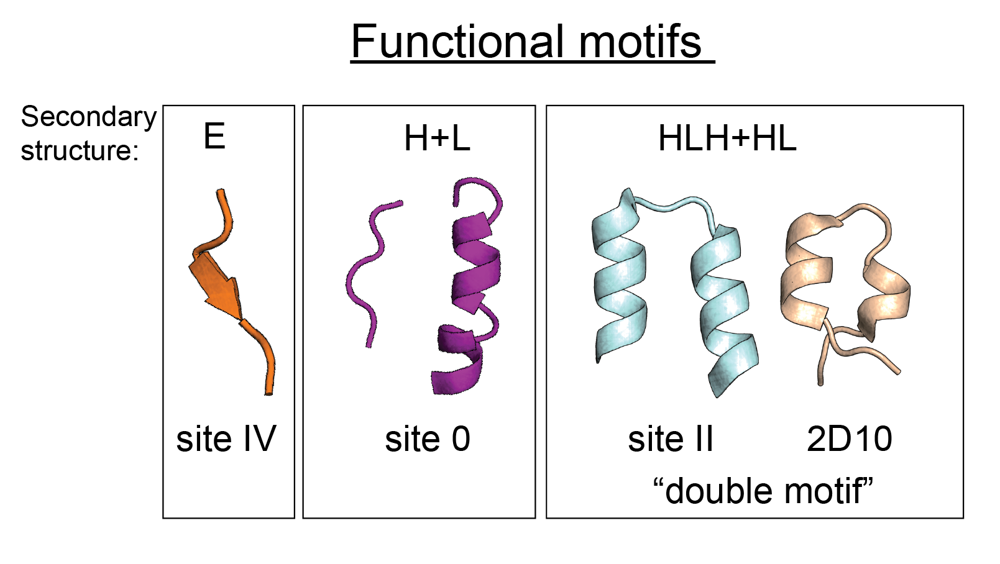

# A bottom up design approach for the *de novo* design of functional proteins
## Table of Contents: 
- [Description](#description)
- [Software prerequisites](#software_prerequisites)
   
## Description
This repository contains additional data presented in the manuscript ["A bottom-up approach for the *de novo* design of functional proteins"](https://doi.org/10.1101/2020.03.11.988071). For further details about the methods and how to install TopoBuilder, please refer to the [TopoBuilder repository](https://github.com/LPDI-EPFL/topobuilder/tree/releasepy2). For each topology designed using TopoBuilder, this repository provides the input files used for the computational design procedure, as well as score files and models of the designed proteins. 
The repository is organized by the functional motifs that were stabilized, which are epitopes targeted by RSV neutralizing antibodies. 

[site IV](./siteIV)                                        [site 0](./site0)                    [double motif](./double_motif)

In general, the computational design process involved three steps: 
1) Topology building using TopoBuilder. For detailed instructions how to install TopoBuilder and general information about the method please refer to the [TopoBuilder documentation](https://github.com/LPDI-EPFL/topobuilder/tree/releasepy2). 
2) FunFolDes to fold and design the topologies. For detailed information about the method, please refer to the [FunFolDes repository](https://github.com/LPDI-EPFL/FunFolDesData), the official [Rosetta documentation](https://www.rosettacommons.org/docs/latest/scripting_documentation/RosettaScripts/composite_protocols/fold_from_loops/FunFolDes) or the [FunFolDes manuscript](https://doi.org/10.1371/journal.pcbi.1006623). 
3) [Rosetta Remodel](https://www.rosettacommons.org/docs/latest/application_documentation/design/Remodel) to optimize connecting loops if necessary.

The subfolders in this repository contain the necessary input files to define the topologies using TopoBuilder, as well as for the folding/design using FunFolDes. For analysing the computational designs as well as the experimental data, we used the [rstoolbox python library](https://doi.org/10.1186/s12859-019-2796-3). 

## Software prerequisites
- Python2.7 
- [Rstoolbox](https://doi.org/10.1186/s12859-019-2796-3) and its dependencies
- [TopoBuilder - Py2 release](https://github.com/LPDI-EPFL/topobuilder/tree/releasepy2)

