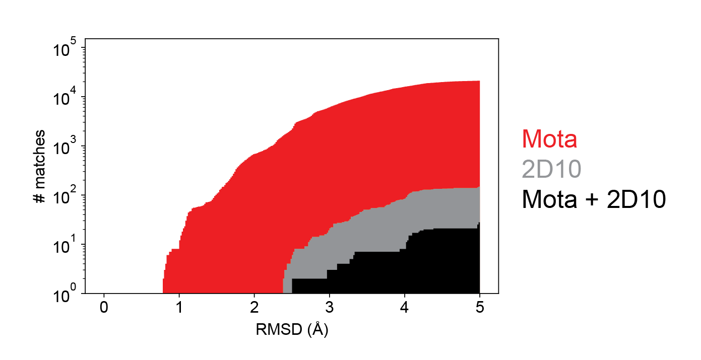

# Assembly of a dual motif scaffold accommodating RSVF site II and RSVG 2D10 epitope
To showcase the ability of assembling a topology de novo tailored to fit two distinct binding motifs, we built a 4H topology embedded with the RSVF site II (PDB codes 3IXT) and RSVG 2D10 motif (PDB codes 5WN9) adapting to HLH and HLL conformation, respectively. 

It is important to note that while each motif was relatively frequently found in the natural protein repertoire, the number of proteins available in the natural protein repertoire that can simultaneously accommodate both motifs was extremely limited as shown in the figure below. 



## 4H topology construction and design (the topology contains four helices to carry two functional motifs) 
The motifs were extracted from previously solved peptide-bound structure with their target antibodies. First, we simply extended around 3-4 helical turns for each epitope by using Rosetta remodel. To assembly the de novo backbone containing 


a beta sheet with four strands and packing with two helices, we used the TopoBuilder to modularly assemble those ideal structural elements together with motifas shown in the [sketch](./1\)Folding_trajectory/input_4E2H/A1E_B2H_C1E_D1E_D2H_B1E/sketch.pdb). The topology was assembled using TopoBuilder with all the tunable parameters specified in json file [here](./1\)Folding_trajectory/input_4E2H/4E2H.json).   
 
### 4H folding and design 
Using the provided [input files](./1\)Folding_trajectory/input_4H), the 4H topology was built and folded using Rosetta FunFolDes, generating approximately around [10000 decoys](./1\)Folding_trajectory/4H_folding_pose.csv). Around 300 decoys were selected according to several scoring metrics: overall energy, core packing and RMSD drifting for both epitopes, and the best scoring decoys were inspected manually. 

Following manual inspection, we increased the length of one residue in a connecting loop linking in between supporting strand and motif spanning from residue 40-42, and remodeled several connecting loops to enforce the formation of secondary structures at the terminus of loop structure. The exact residues need to adapt the loop remodeling are listed in [blueprint](./2\)Remodel_fix_connection/4E2H_rd1_blueprint). For instructions regarding the Rosetta remodel application, please see the offical Rosetta documentation. To run remodel algorithm, use: 

```
PATH/TO/ROSETTA/main/source/bin/remodel.linuxgccrelease -database PATH/TO/DATABASE -s 4E2H_folding_rd1.pdb -remodel:blueprint 4E2H_rd1_blueprint -nstruct 50 -remodel:use_pose_relax true -ex1 -ex2 
```  

The remodeled template subsequently served as template for the constrianed sequence design using the [provided script](./3\)Sequence_design_selection/4E2H_layerdesign_protocol.xml) with a defined [Resfile](./3\)Sequence_design_selection/4E2H_rd2_Resfile) to specify the positions to be sampled. The Design script can be executed by the following command line:  

```
PATH/TO/ROSETTA/main/source/bin/rosetta_scripts.linuxiccrelease @4E2H_rd2_flags -s 4E2H_rd2_seq_design.pdb -parser:protocol 4E2H_layerdesign_protocol.xml
``` 
The decoys generated from the sequence design were [provided](./3\)Sequence_design_selection/4E2H_rd2.minisilent). 

Based on an ensemble of the 100 best decoys according to total energy, we selected 12 core positions and 8 surface positions close to the binding interface to construct a sequence library for combinatorial sampling of a restricted set of amino acids which was suggested by Rosetta (Fig.S5). 

### 4H library design and testing 
For experimental testing, we assembled the combinatorial library by primers carrying the degenerate codon to cover a defined diversity in 20 critical positions, as detailed below.

| Position| AA to sample|
| :------:|:-----------:|
| 5       | EV          |
| 6       | LV          |
| 9       | RW          |
| 10      | LV          | 
| 13      | LV          | 
| 16      | KQ          | 
| 17      | IV          | 
| 30      | IV          |
| 33      | LQ          |
| 37      | LV          | 
| 40      | LQ          |
| 41      | LV          |
| 42      | RW          |
| 50      | FLV         |
| 51      | HQ          |
| 54      | LV          |
| 57      | EKQ         |
| 58      | LV          |
| 75      | LV          |
| 78      | LV          |

The following animation shows the [best scoring decoy](./4H.gif), which was chosen as a template to select critical core positions for combinatorial sampling. Selected core positions encoded in the combinatorial library are highlighted in green, and the site IV epitope shown in orange. 


The library was screened using yeast surface display under double selective pressure: binding to 101F antibodies, and residual binding after pre-treatment of the nonspecific protease chymotrypsin to ensure the designed topology presents the functional motif in its native conformation, while maintaining the stable protein fold (Fig.S8). For each screening condition, the best 1-2% of clones were sorted, and the sorted populations were bulk-sequenced using next-generation sequencing. We then computed an enrichment score for each sequence, which represents the frequency of each sequence under stringed selection conditions. All protein sequences and their computed enrichments under selection for binding to 101F, or 101F+chymotrypsin can be found [here](./4\)NGS_seq/4b2a_NGS.csv). The computational models of the sequences with the strongest enrichments can be found [here](). Followed with next-generation sequencing, we then choose around 4 sequences showing the strongest enrichments for recombinant expression and biophysical characterization.


