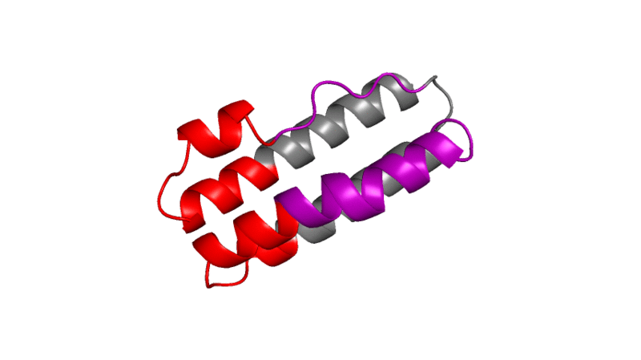

# Building of the 3H1L_01 topology to accommodate RSVF antigenic site 0 
To accommodate the antigenic site 0 (RSVF structure: PDB DI 4jhw, residues 196-212 and 63-69), we used the TopoBuilder to built two supporting helices as shown in the [sketch](./A1H_B1C_A2H_B2H/sketch.pdb) and the illustration below. Each helix was built with a length of 20 amino acids, with a distance between each other and to the site 0 epitope of 11 A. The configuration file to built the topology can be found [here](./Topo2H_rev.json).  

Following a first round of folding (see [output](./A1H_B1C_A2H_B2H/out)), we selected one of the best decoys according to total rosetta energy and optimized the loop connections using Rosetta Remodel. A blueprint file to build the connecting loops can be found [here](./optimization/3H1L.blueprint). 
For instructions regarding the Rosetta remodel application, please see the offical Rosetta documentation. To run remodel, use: 

'''
PATH/TO/ROSETTA/main/source/bin/remodel.linuxgccrelease -database PATH/TO/DATABASE -s 3H1L_01_remodel_input.pdb  -remodel:blueprint 3H1L_01.remodel.blueprint -nstruct 100 -remodel:use_pose_relax true -ex1 -ex2 
''' 

In the following animation, the segments that were remodeled are colored red, the segments built by TopoBuilder are grey, and the site 0 epitope is colored purple. 

