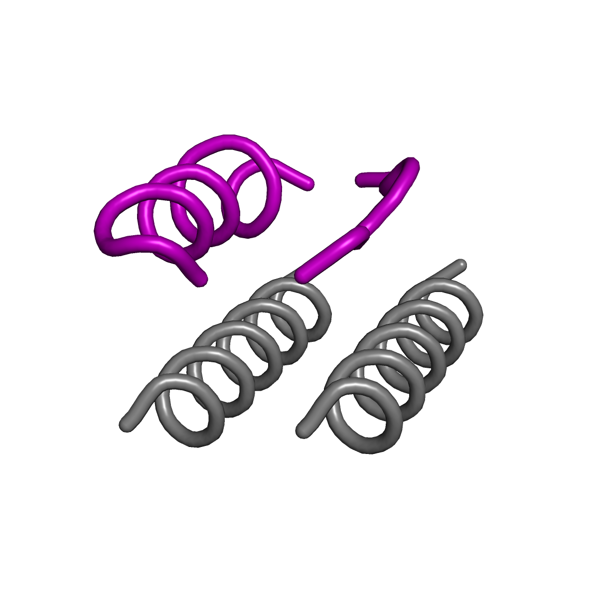

# Building of the 3H1L_01 topology to accommodate RSVF antigenic site 0 
To accommodate the antigenic site 0 (RSVF structure: PDB DI 4jhw, residues 196-212 and 63-69), we used the TopoBuilder to built two supporting helices as shown in the [sketch](./A1H_B1C_A2H_B2H/sketch.pdb) and the illustration below. Each helix was built with a length of 20 amino acids, with a distance between each other and to the site 0 epitope of 11 A. The configuration file to built the topology can be found [here](./Topo2H_rev.json).  
To accommodate the antigenic site 0 (RSVF structure: PDB DI 4jhw, residues 196-212 and 63-69), we used the TopoBuilder to built two supporting helices as shown in the sketch(./A1H_B1C_A2H_B2H/sketch.pdb) and the illustration below. Each helix was built with a length of 20 amino acids, with a distance between each other and to the site 0 epitope of 11 A. The configuration file to built the topology can be found here(./Topo2H_rev.json).  

