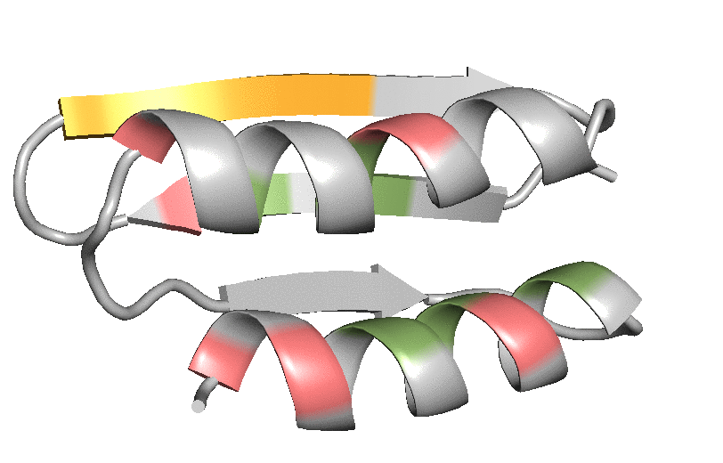

# Design of a 3E2H topology to accommodate the RSVF antigenic site IV 
## 3E2H topology construction and design 

The antigenic site IV was extracted from the peptide-bound structure with its target antibody 101F (PDB 3O41, chain F). 

As described throughout the methods, a major strength of the TopoBuilder is the ability to systematically enumerate all possible forms (a string representation defining the secondary structure composition and their connectivity) that can accommodate a given motif. For detailed method information, please refer to our [TopoBuilder repository](https://github.com/LPDI-EPFL/topobuilder/tree/releasepy2).

Here, we present the building and design steps for a 3E2H topology (3 beta strands and 2 helices). We used the TopoBuilder to built two supporting strands to form a beta-sheet with the site IV motif and two helices in another layer to pack against the sheet as shown in the [sketch](./1\)Foling_trajectory/B1E_C1E_C2H_A1E_A2H/input_3E2H/sketch.pdb). 

Each strand was built with a length of 7 amino acids, and the positioning of each secondary structure is as follows:

```
{
  "layers" : [
     [
      {
        "type" : "E",
        "length" : 7,
        "tilt_y" : 90,
        "shift_x" : -1,
      	"shift_y" : -2,
	      "shift_z" : 13.1
      },
      {
        "type" : "H",
        "length" : 16,
        "shift_x" : 9,
        "tilt_y" : -180,
        "shift_y" : -2,
	      "shift_z" : 10,
        "tilt_x" : -5
      }
    ],
    [
      {
        "type" : "E",
        "length" : 7,
	      "tilt_y" : -95,
	      "shift_x" : -1.3,
	      "shift_y" : -2,
	      "shift_z" : 6.8
      }
    ],
    [
      {
        "type" : "E",
        "ref" : "101.strand1"
      },
      {
        "type" : "H",
 	      "length" : 15,
	      "shift_z" : -3,
        "shift_x" : 11.5,
        "tilt_x" : -5,
        "tilt_y" : -180
      }
    ]
  ],
  "config" : {
    "name" : "101"
  },
  "motifs" : [
    {
      "id" : "101",
      "chain" : "A",
      "pdbfile" : "template.pdb",
      "segments" : [
        {
          "ini" : 28,
          "end" : 34,
          "id" : "strand1"
        }
      ]
    }
  ]
}
```

### 3E2H folding and design 
Using the provided input files, the 3E2H topology was folded using Rosetta FunFolDes, generating approximatelyaround 15000 [decoys](./1\)Foling_trajectory/B1E_C1E_C2H_A1E_A2H/3E2H_folding_design.csv). The top 100 decoys were selected according to several scoring metrics: overall energy, core packing and ramachandran scores, and the best scoring decoys were inspected manually. 

Following manual inspection, we remodeled and shortened a connecting loop between residues 22-27, using the provided [blueprint](./2\)Remodel_fix_connection/3E2H_rd1_blueprint) and Rosetta Remodel. For instructions regarding the Rosetta remodel application, please see the offical Rosetta documentation. To run remodel, use: 

```
PATH/TO/ROSETTA/main/source/bin/remodel.linuxgccrelease -database PATH/TO/DATABASE -s 3E2H_folding_rd1.pdb -remodel:blueprint 3E2H_rd1_blueprint -nstruct 50 -remodel:use_pose_relax true -ex1 -ex2 
``` 

The shortened template subsequently served as template for a second round of constrained sequence design and for building a disulfide bridge using the [provided script](./3\)Sequence_design_selection/3E2H_layerdesign_protocol.xml).The design script can be executed by the following command line:  

```
PATH/TO/ROSETTA/main/source/bin/rosetta_scripts.linuxiccrelease @3E2H_rd2_flags -s 3E2H_rd2_sequence_design.pdb -parser:protocol 3E2H_layerdesign_protocol.xml 
```

The decoys generated from the second round of sequence design can be found [here](./3\)Sequence_design_selection/3E2H.minisilent.gz). Based on an ensemble of the 100 best decoys according to total energy, we selected 7 core positions and 6 potential positions close to the binding interface to build a sequence library for combinatorial sampling of a restricted set of amino acids for the given positions (see Fig.S3 in our manuscript). 

### 3E2H library design and testing 
For experimental testing, we assembled the combinatorial library by primers with degenerate codons to encode a defined diversity in 13 critical positions, as detailed below.

| Position| AA to sample|
| :------:|:-----------:|
| 5       | IV          |
| 7       | IV          |
| 8       | EGKR        |
| 28      | AE          | 
| 29      | FILV        | 
| 33      | RW          | 
| 36      | AG          | 
| 50      | FILM        |
| 53      | HLQR        |
| 54      | LV          | 
| 57      | AV          |
| 60      | EV          |
| 62      | EKQ         |

The following animation shows the [best scoring decoy](./3\)Sequence_design_selection/3E2H_rd2_sequence_design.pdb), which was chosen as a template to select critical core positions for combinatorial sampling. Selected core positions encoded in the combinatorial library are highlighted in green, the positions in a proximity of the binding interface are colored in light red, and the site IV epitope shown in orange. 



The library was screened using yeast surface display under double selective pressure: binding to 101F antibodies, and residual binding after pre-treatment of the nonspecific protease chymotrypsin to ensure the designed topology presents the functional motif in its native conformation, while maintaining the stable protein fold. For each screening condition, the best 1-2% of clones were sorted, and the sorted populations were bulk-sequenced using next-generation sequencing. We then computed an enrichment score for each sequence, as detailed in the manuscript. All protein sequences and their computed enrichments under selection for binding to 101F, or 101F+chymotrypsin can be found [here](./4\)NGS_seq/3E2H_NGS.csv). The computational models of the sequences with the strongest enrichments can be found [here](). A subset of sequences with the strongest enrichments were chosen for recombinant expression and biophysical characterization. 
