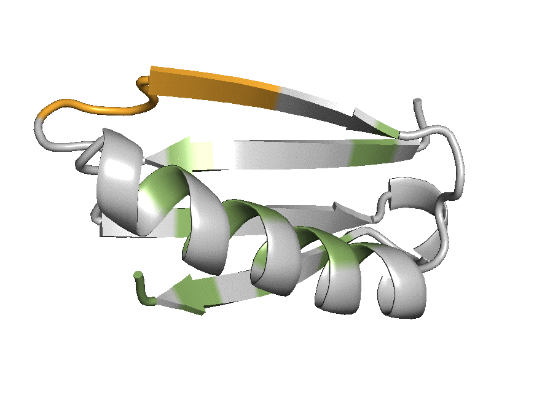

# Design of a 4E1H topology to accommodate the RSVF antigenic site IV 
## 4E1H topology building
As mentioned in the description of [3E2H](../3E2H/README.md), the motif was extracted from previously solved peptide-bound structure with its target antibody. In order to build a *de novo* backbone consisting of a beta sheet with four strands packing against a helix, we used the TopoBuilder to modularly assemble stabilizing secondary structures around the motif as shown in the [sketch](./1\)Folding_trajectory/input_4E1H/A2E_A1E_D1H_B1E_C1E/sketch.pdb). The TopoBuilder configuration file can be found [here](./1\)Folding_trajectory/input_4E1H/4E1H.json).   
 
## 4E1H folding and design 
Using the provided [input files](./1\)Foling_trajectory/input_4E1H), the 4E1H topology was folded using [Rosetta FunFolDes](https://journals.plos.org/ploscompbiol/article?id=10.1371/journal.pcbi.1006623), generating approximately around 10000 decoys. The [top 300 decoys](./1\)Folding_trajectory/top_300_folding_pose.zip) were selected according to several scoring metrics: overall energy, core packing and content of secondary structures, and the best scoring decoys were inspected manually. 

Following manual inspection, we remodeled and shortened a connecting loop between residues 8-12, and also extending 3 residues at the C-terminus with the provided [blueprint](./2\)Remodel_fix_connection_design/4E1H_rd1_blueprint). For instructions regarding the Rosetta remodel application, please see the offical [Rosetta documentation](https://www.rosettacommons.org/docs/latest/application_documentation/design/Remodel). To run remodel, use: 

```
PATH/TO/ROSETTA/main/source/bin/remodel.linuxgccrelease -database PATH/TO/DATABASE -s 4E1H_folding_rd1.pdb -remodel:blueprint 4E1H_rd1_blueprint -nstruct 50 -remodel:use_pose_relax true -ex1 -ex2 
```  

The shortened template subsequently served as template for the first round of sequence design using the [provided script](./2\)Remodel_fix_connection_design/4E1H_rd1_fastdesign_.xml) with a defined [Resfile](./2\)Remodel_fix_connection_design/Resfile) to specify positions and the sampled amino acid diversity. The Design script can be executed by the following command line:  

```
PATH/TO/ROSETTA/main/source/bin/rosetta_scripts.linuxiccrelease -s 4E1H_folding_rd1_design.pdb -parser:protocol 4E1H_rd1_fastdesign_.xml
``` 
The decoys generated from the first round of sequence design are [provided here](./2\)Remodel_fix_connection_design/4E1H_rd1_seqDesign_score.sc). 

The decoys generated from the first round of design step remained suboptimal, in particular missing hydrogen bond pairing within the beta sheet). Thus, we used FunFolDes to refine/refold the 4E1H topology, constraining the beta sheet pairing. All the input files needed for running FunFolDes are provided [here](./3\)FunFold_Design), with the following command:

```
PATH/TO/ROSETTA/main/source/bin/rosetta_scripts.linuxiccrelease @FunFoldDes_flags -s 4E1H_design_rd2.pdb  -parser:protocol 4E1H_rd2_FunFoldDes.xml
```

The sequences generated from FunFoldDes are provided [here](./3\)FunFold_Design/4E1H_rd2_FunFoldDes_decoys.csv). After folding, an additional constrained sequence design step was performed to introduce disulfide bridge and sample core and surface positions close to the potential binding interface. All the input files needed for running the design script are provided [here](./4\)Final_sequence_design), and can be executed by:

```
PATH/TO/ROSETTA/main/source/bin/rosetta_scripts.linuxiccrelease @flags -s 4E1H_FFD_rd3.pdb  -parser:protocol 4E1H_rd3_sequence_des.xml
```

Based on an ensemble of the [100 best decoys](./4\)Final_sequence_design/4E1H_rd3_design_decoy.csv) according to total energy, we selected 14 core positions to construct a sequence library for combinatorial sampling of a restricted set of amino acids which were suggested by Rosetta (see Fig.S4 in the manuscript). 

## 4E1H library design and testing 
For experimental testing, we assembled the combinatorial library by primers carrying degenerate codons to cover a defined diversity in 14 critical positions, as detailed below.

| Position| AA to sample|
| :------:|:-----------:|
| 3       | FIL         |
| 7       | IV          |
| 19      | FINY        |
| 27      | ALPV        | 
| 30      | FHLY        | 
| 31      | AV          | 
| 34      | FHLY        | 
| 35      | AV          |
| 38      | ALPV        |
| 46      | IV          | 
| 56      | VF          |
| 58      | CFY         |
| 60      | DFVY        |
| 62      | AV          |

The following animation shows the [best scoring decoy](./4E1H.gif), with selected core positions encoded in the combinatorial library highlighted in green, and the site IV epitope shown in orange. 



The library was screened using yeast surface display for binding to 101F, and residual binding after pre-treatment of the nonspecific protease chymotrypsin (see Fig.S8 of the manuscript). For each screening condition, the best 1-2% of clones were sorted, and the sorted populations were bulk-sequenced using next-generation sequencing. We then computed an enrichment score for each sequence as described in the manuscript. All protein sequences and their computed enrichments under selection for binding to 101F, or 101F+chymotrypsin can be found [here](./5\)NGS_seq/4E1H_NGS.csv). The computational models of the sequences with the strongest enrichments can be found [here]().

